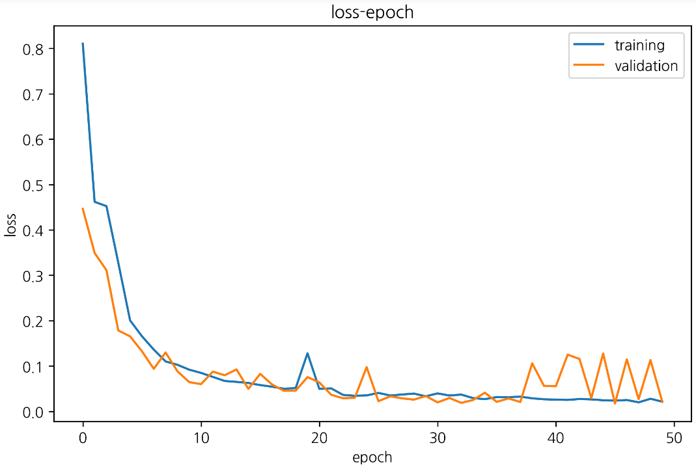

# AI_Benchmark_Test

## ResNet50
batch size : 256 optimizer : Adam learning rate : 0.001 epoch : 50

.png)

```text
[1] Train loss: 0.810 - accuracy: 0.726
Valid_loss: 0.446 - accuracy: 0.748
[2] Train loss: 0.462 - accuracy: 0.843
Valid_loss: 0.349 - accuracy: 0.851
[3] Train loss: 0.452 - accuracy: 0.850
Valid_loss: 0.311 - accuracy: 0.861
[4] Train loss: 0.328 - accuracy: 0.891
Valid_loss: 0.178 - accuracy: 0.901
[5] Train loss: 0.200 - accuracy: 0.932
Valid_loss: 0.165 - accuracy: 0.936
[6] Train loss: 0.166 - accuracy: 0.943
Valid_loss: 0.133 - accuracy: 0.946
[7] Train loss: 0.136 - accuracy: 0.954
Valid_loss: 0.094 - accuracy: 0.957
[8] Train loss: 0.110 - accuracy: 0.961
Valid_loss: 0.130 - accuracy: 0.963
[9] Train loss: 0.103 - accuracy: 0.966
Valid_loss: 0.089 - accuracy: 0.967
[10] Train loss: 0.092 - accuracy: 0.968
Valid_loss: 0.065 - accuracy: 0.970
[11] Train loss: 0.085 - accuracy: 0.971
Valid_loss: 0.060 - accuracy: 0.973
[12] Train loss: 0.076 - accuracy: 0.974
Valid_loss: 0.088 - accuracy: 0.976
[13] Train loss: 0.067 - accuracy: 0.977
Valid_loss: 0.080 - accuracy: 0.979
[14] Train loss: 0.065 - accuracy: 0.977
Valid_loss: 0.092 - accuracy: 0.978
[15] Train loss: 0.063 - accuracy: 0.978
Valid_loss: 0.050 - accuracy: 0.980
[16] Train loss: 0.058 - accuracy: 0.980
Valid_loss: 0.083 - accuracy: 0.981
[17] Train loss: 0.054 - accuracy: 0.982
Valid_loss: 0.059 - accuracy: 0.982
[18] Train loss: 0.050 - accuracy: 0.983
Valid_loss: 0.045 - accuracy: 0.984
[19] Train loss: 0.051 - accuracy: 0.982
Valid_loss: 0.046 - accuracy: 0.983
[20] Train loss: 0.128 - accuracy: 0.960
Valid_loss: 0.076 - accuracy: 0.964
[21] Train loss: 0.050 - accuracy: 0.984
Valid_loss: 0.064 - accuracy: 0.984
[22] Train loss: 0.051 - accuracy: 0.983
Valid_loss: 0.037 - accuracy: 0.984
[23] Train loss: 0.036 - accuracy: 0.988
Valid_loss: 0.029 - accuracy: 0.989
[24] Train loss: 0.034 - accuracy: 0.988
Valid_loss: 0.030 - accuracy: 0.989
[25] Train loss: 0.035 - accuracy: 0.989
Valid_loss: 0.098 - accuracy: 0.989
[26] Train loss: 0.041 - accuracy: 0.986
Valid_loss: 0.023 - accuracy: 0.987
[27] Train loss: 0.035 - accuracy: 0.988
Valid_loss: 0.033 - accuracy: 0.989
[28] Train loss: 0.037 - accuracy: 0.987
Valid_loss: 0.029 - accuracy: 0.988
[29] Train loss: 0.039 - accuracy: 0.987
Valid_loss: 0.026 - accuracy: 0.988
[30] Train loss: 0.033 - accuracy: 0.989
Valid_loss: 0.034 - accuracy: 0.989
[31] Train loss: 0.040 - accuracy: 0.987
Valid_loss: 0.020 - accuracy: 0.988
[32] Train loss: 0.035 - accuracy: 0.988
Valid_loss: 0.030 - accuracy: 0.989
[33] Train loss: 0.037 - accuracy: 0.988
Valid_loss: 0.019 - accuracy: 0.989
[34] Train loss: 0.029 - accuracy: 0.990
Valid_loss: 0.025 - accuracy: 0.990
[35] Train loss: 0.027 - accuracy: 0.991
Valid_loss: 0.041 - accuracy: 0.990
[36] Train loss: 0.032 - accuracy: 0.990
Valid_loss: 0.021 - accuracy: 0.990
[37] Train loss: 0.031 - accuracy: 0.989
Valid_loss: 0.029 - accuracy: 0.990
[38] Train loss: 0.033 - accuracy: 0.989
Valid_loss: 0.021 - accuracy: 0.989
[39] Train loss: 0.029 - accuracy: 0.991
Valid_loss: 0.106 - accuracy: 0.991
[40] Train loss: 0.027 - accuracy: 0.991
Valid_loss: 0.056 - accuracy: 0.992
[41] Train loss: 0.026 - accuracy: 0.991
Valid_loss: 0.056 - accuracy: 0.992
[42] Train loss: 0.025 - accuracy: 0.992
Valid_loss: 0.125 - accuracy: 0.992
[43] Train loss: 0.027 - accuracy: 0.991
Valid_loss: 0.116 - accuracy: 0.992
[44] Train loss: 0.027 - accuracy: 0.991
Valid_loss: 0.029 - accuracy: 0.991
[45] Train loss: 0.025 - accuracy: 0.992
Valid_loss: 0.128 - accuracy: 0.993
[46] Train loss: 0.024 - accuracy: 0.992
Valid_loss: 0.017 - accuracy: 0.993
[47] Train loss: 0.025 - accuracy: 0.992
Valid_loss: 0.115 - accuracy: 0.992
[48] Train loss: 0.020 - accuracy: 0.994
Valid_loss: 0.027 - accuracy: 0.993
[49] Train loss: 0.028 - accuracy: 0.991
Valid_loss: 0.113 - accuracy: 0.991
[50] Train loss: 0.021 - accuracy: 0.993
Valid_loss: 0.021 - accuracy: 0.993
학습시간: 33m 57s
```

## SqueezeNet1_1

ResNet50 model에 비해 학습이 굉장히 빠름을 확인.. 성능은 부족
ResNet에서 필요한 출력이 모두 가능해 졌을 때 함께 측정
